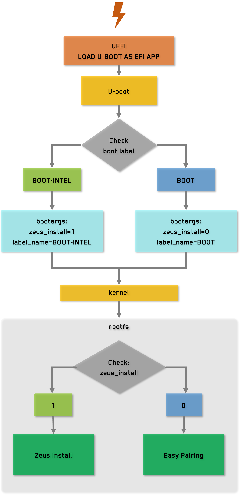

# zeus-intel

CLI disk imaging tool for cloning the running system image to a target block device that is not the source disk.

## Usage

Check the `zeus-intel` help command for usage instructions:

```bash
zeus_intel --help | jq
```

> All the output is in JSON format for easy parsing and integration into scripts or other tools.

```json
{
  "ok": true,
  "action": "help",
  "usage": [
    "--list",
    "--device <name|/dev/name> [--yes]",
    "<name|/dev/name> [--yes]"
  ],
  "options": [
    "-l,--list",
    "-d,--device",
    "-y,--yes",
    "-h,--help"
  ]
}
```

## Architecture

The tool was designed to be run in an image that was built following the [`cookbook-intel`](https://github.com/gaiaBuildSystem/cookbook-intel) guidelines. So it relies on the presence of certain kernel arguments passed by the bootloader, and on the presence of certain files in `/boot` to determine the source disk and the possible valid target disks. The follow flowchart illustrates the architecture of the tool when boot from an [PhobOS](https://github.com/gaiaBuildSystem/cookbook-phobos) image:

<p align="center">
    
</p>

## Notes

- The source disk (the one the system booted from) is automatically excluded from targets.
- The tool validates the target against discovered block devices in `/sys/block`.
- Flashing requires sufficient privileges to read/write raw block devices.
